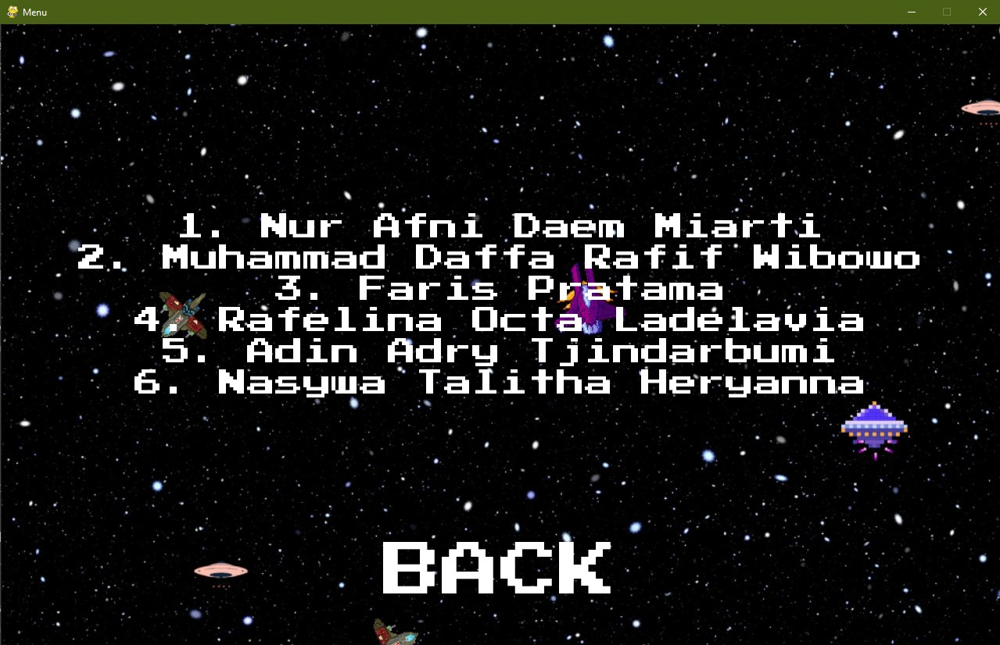

# Galactic-Endless

## Table of Contents
- [Description](#description)
- [Library](#library)
- [How to Run](#how-to-run)
- [How to Play](#how-to-play)
- [UML Diagram](#uml-diagram)
- [Demo Video Galactic Endless](#demo-video)
- [Contributors](#contributors)
- [Reference](#reference)

## Description
Galactic Endless adalah sebuah permainan sederhana dengan tema perang antariksa dimana pemain bertugas sebagai pilot pesawat ruang angkasa yang harus melindungi galaksi dari invasi musuh. Pemain mempunyai tujuan sederhana, yakni bertahan selama mungkin dan mencapai skor tertinggi. Namun, pemain harus menghindari serangan musuh yang datang dari berbagai arah sambil mengatur tembakan untuk menghancurkan kapal-kapal musuh seefisien mungkin. Di samping itu, pemain juga harus berhati-hati agar tidak secara tidak sengaja merusak kapal-kapal sekutu, karena ini akan mengurangi skor dan kemungkinan mengakhiri permainan.

## Library
- Pygame
- Math
- Sys
- Random

## How to Run
<li> Install Python 3.6 or higher</li>

<li> Download file dengan format zip, lalu ekstrak file</li>


<li> Open file "main.py", kemudian jalankan.</li>
<p>For Windows</p>

```bash
python main.py
```

<p>For Mac</p>

```bash
python3 main.py
```

## How to Play
- Berikut tampilan dari menu game. Tersedia 3 button, yakni play, credits, dan exit. Untuk memulai permainan, klik tombol play.


- Berikut merupakan tampilan ketika credits di-klik. Menampilkan nama-nama kontributor yang mengembangkan game Galactic Endless.


- Berikut merupakan tampilan game yang sedang berjalan. Dengan keterangan nyawa pada pojok kiri atas, skor saat bermain, serta skor tertinggi pada pojok kanan atas.


- Ini adalah tampilan ketika game telah berakhir. Untuk bermain kembali, player dapat menekan tab.


## UML Diagram


## Demo Video
[Demo Video Galactic Endless](https://drive.google.com/file/d/1aXzYxojGRQmuKSk2Obf2erv1IV9Rk_al/view?usp=sharing)

## Contributors
<table>
  <tr>
    <th>Nama</th>
    <th>NIM</th>
  </tr>
  <tr>
    <td>Nur Afni Daem Miarti</td>
    <td>122140011</td>
  </tr>
  <tr>
    <td>Muhammad Daffa Rafif Wibowo</td>
    <td>122140036</td>
  </tr>
  <tr>
    <td>Faris Pratama</td>
    <td>122140021</td>
  </tr>
  <tr>
    <td>Rafelina Octa Ladelavia</td>
    <td>122140082</td>
  </tr>
  <tr>
    <td>Adin Adry Tjindarbumi</td>
    <td>122140024</td>
  </tr>
  <tr>
    <td>Nasywa Talitha Heryanna</td>
    <td>122140046</td>
  </tr>
</table>

## Reference
- [Main Menu](https://youtu.be/GMBqjxcKogA?si=vV2MWWq2jAYe9HZG)
- [Game](https://youtube.com/playlist?list=PLlEgNdBJEO-muprNCDYiKLZ-Kc3-p8thS&si=geoQv1_xK-M-Y5Nd)
- [Sound FX](https://opengameart.org/)
- [Aset Gambar](https://canva.com)
