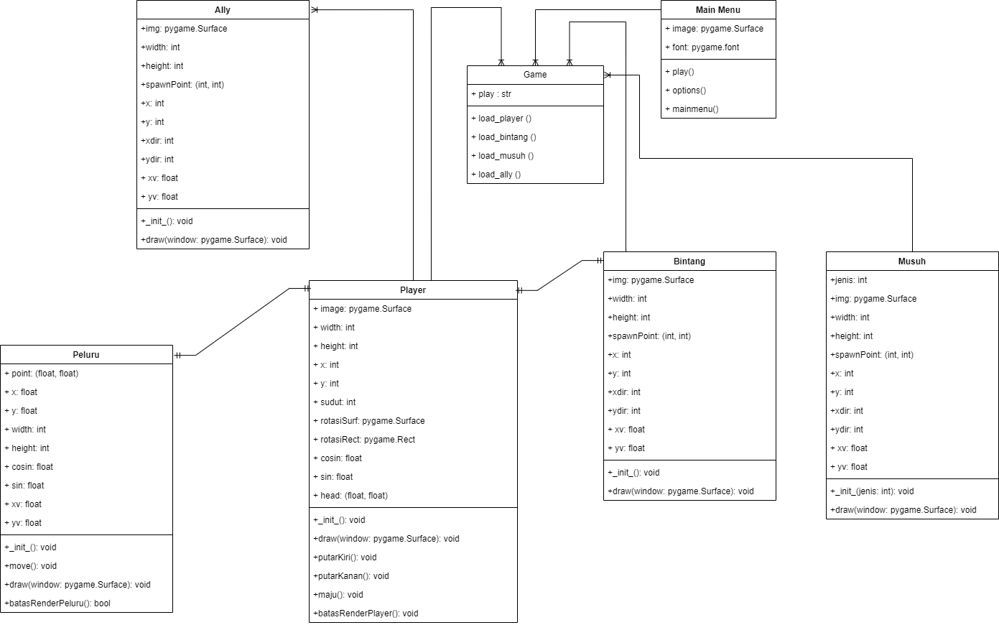

# Galactic-endless
Tubes PBO-Galactic Endless

[How to Play]coming soon

[Contributors](#contributors)

## Description
Galactic Endless adalah permainan sederhana dengan tema perang antariksa dimana pemain bertugas sebagai pilot pesawat ruang angkasa yang harus melindungi galaksi dari invasi musuh. Pemain memiliki tujuan sederhana, yakni bertahan selama mungkin dan mencapai skor tertinggi. Namun, pemain harus menghindari serangan musuh yang datang dari berbagai arah sambil mengatur tembakan untuk menghancurkan kapal-kapal musuh seefisien mungkin. Di samping itu, pemain juga harus berhati-hati agar tidak secara tidak sengaja merusak kapal-kapal sekutu, karena ini akan mengurangi skor dan kemungkinan mengakhiri permainan.


## Library
- Pygame

## How to Play
<li> Install Python 3.6 or higher</li>
Run the following command to start the game:

```
python3 main.py
```
alternative command:

```
python main.py
```
## UML Diagram



## Contributors

| Nama | NIM | 
| ---- | --- | 
1. Nur Afni Daem Miarti (122140011)
2. Muhammad Daffa Rafif Wibowo (122140036) 
3. Faris Pratama (122140021)
4. Rafelina Octa Ladelavia (122140082)
5. Adin Adry Tjindarbumi (122140024)
6. Nasywa Talitha Heryanna (122140046)
